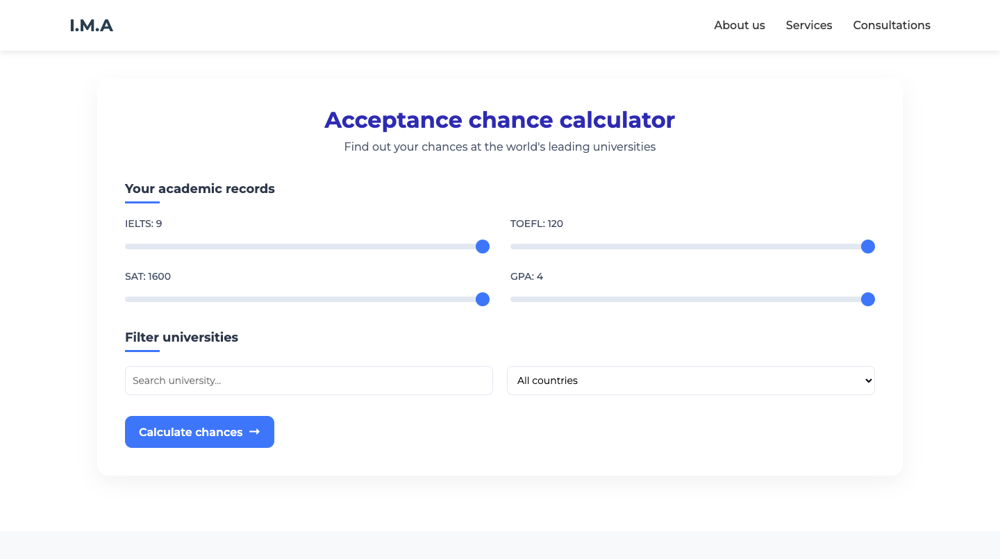
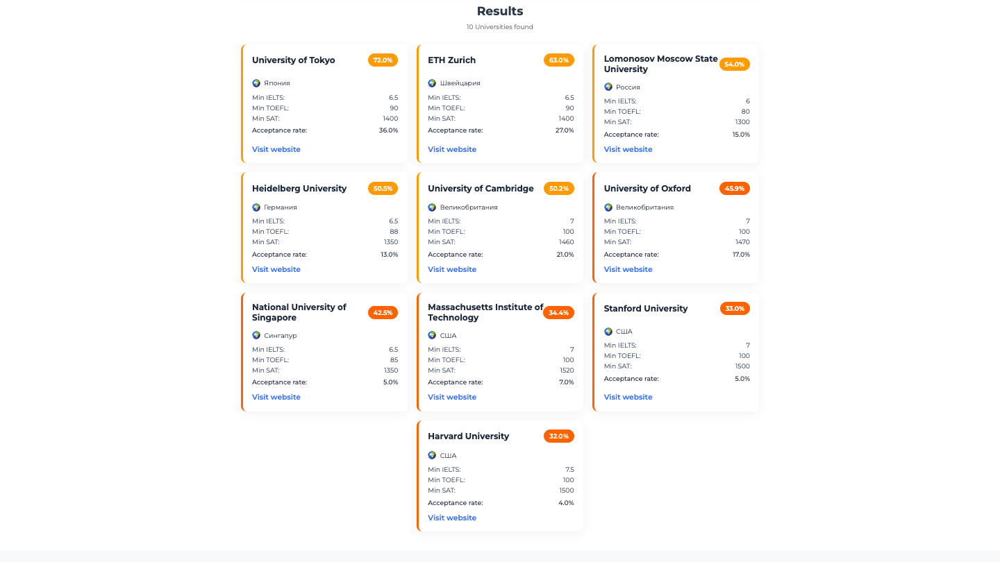

# 🎓 Admission Chance Estimator

A web platform that helps applicants assess their chances of admission to a university based on exam results and requirements of specific universities.

## 📌 About the project

The project was created as a part of a thesis with the aim of simplifying the process of choosing a university for applicants. The platform allows you to enter your exam scores (IELTS, TOEFL, SAT) and receive accurate estimates of your chances of admission based on the minimum requirements of the university.

## 🚀 Main functionality

- 📈 Algorithm for assessing chances of admission
- 📄 List of universities with requirements
- 📊 Convenient form of data entry
- 📚 Information pages (FAQ, About us, Blog etc.)
- 🖥 Fully adapted interface

## 🛠 Technologies

- React (Frontend)
- HTML / CSS
- JSON Server (`db.json`) like mock-backend
- JS algorithm for analyzing the chances of admission

## 🧮 Algorithm

Compares the entered data with the minimum requirements of the selected university. If the user does not reach the minimum threshold, the chance is 0%. Otherwise, the chance is calculated using the formula taking into account the university's `acceptanceRate` and bonuses for exceeding the minimum score.

## 🧭 Navigation

The platform includes the following pages:

- `Main` — Home
- `Admission` — Assessment of chances
- `FAQ` — Frequently asked questions
- `About` — About the project
- `Blog` — Informational articles
- `Contacts` — Contacts
- `Privacy` — Privacy policy
- `Services` — Description of services
- `Subscription` — Subscription plans

## 🖼 Screenshots

### 🏠 Main page


### 📝 Evaluation form


### 📊 Results


## 💡 How to run

1. Clone the repository:
```bash
git clone https://github.com/MambaXan/diplomka.git
cd diplomka